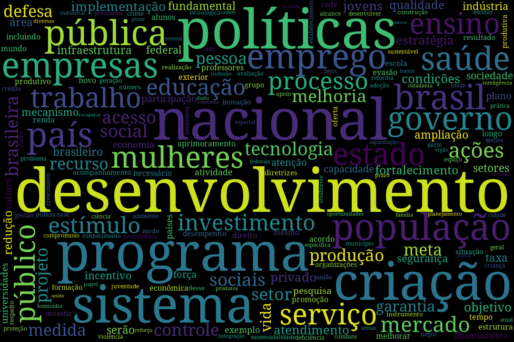
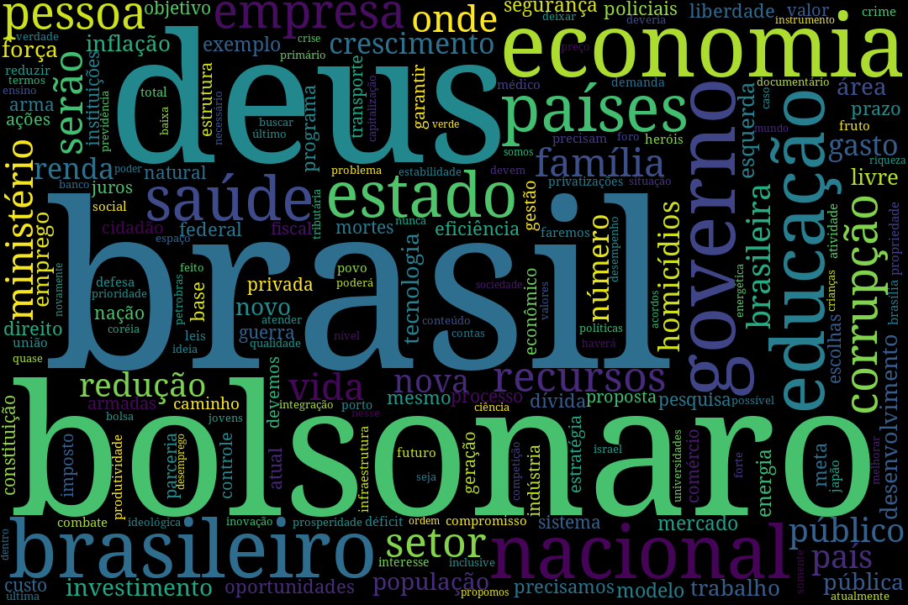
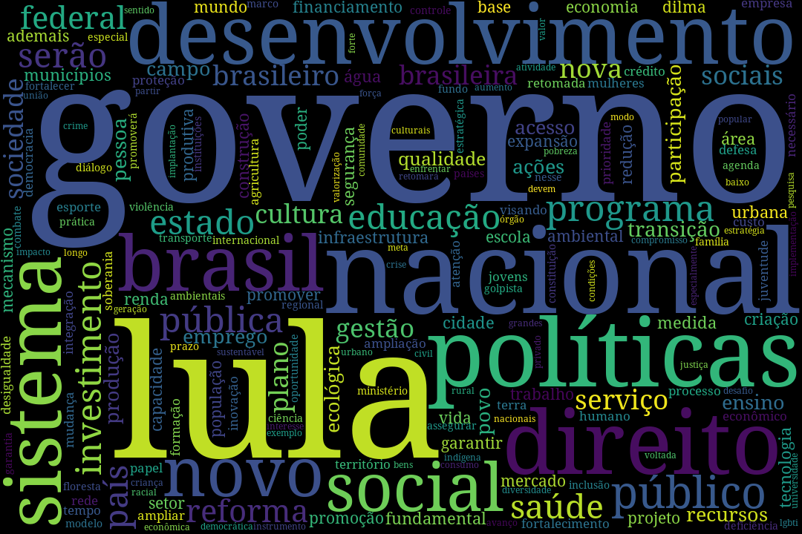
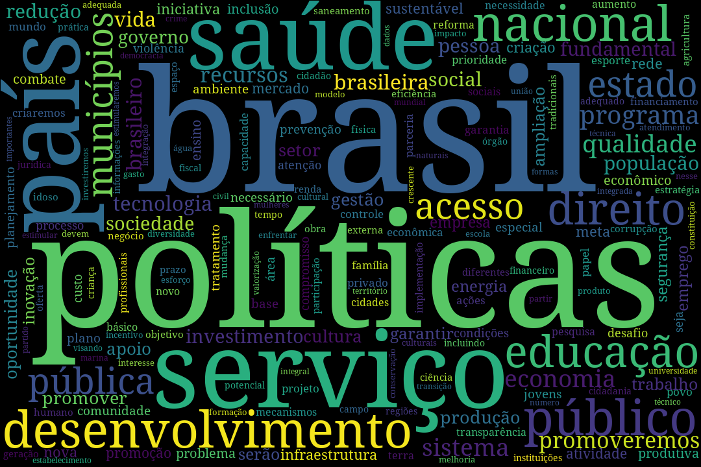

# Nuvem dos Candidatos

__Clique aqui para ver um passo a passo interativo sobre o processo de construir as nuvens:__

Ano de eleição, ano de montes de texto sobre planos de governo de diversos candidatos.
Seguindo os moldes do que fiz na [votação do impeachment de 2016 na câmara](https://github.com/fbidu/impeachment-cloud) vou montar nuvens de palavras com base nos planos de governo dos presidenciáveis.

Todos os planos foram baixados em PDF do site do TSE e convertidos para texto utilizando ferramentas automáticas. Falhas no processo de conversão podem ocorrer e, caso os planos sejam disponibilizados em formato de texto puro, esse projeto será atualizado.

Quanto maior a palavra, maior a frequência com que ela aparece no texto.

## Brincando com o código

O arquivo [passo_a_passo.ipynb](https://github.com/fbidu/nuvem-candidatos/blob/master/passo_a_passo.ipynb) explica em detalhes como é o processo de limpeza e geração das nuvens. Você pode abri ele aqui mesmo no GitHub ou clicar no link do "MyBinder" ali em cima para ter uma versão completamente interativa do código, direto do seu navegador, sem precisar instalar nada.

## Nuvens atuais

Em ordem alfabética

### Álvaro Dias

### Cabo Daciolo

### Ciro Gomes

### Eymael

### Geraldo Alckmin

### Guilherme Boulos

### Henrique Meireles

### Jair Bolsonaro

### João Amoedo

### João Goulart Filho

### Luiz Inácio Lula da Silva

### Marina Silva

### Vera

## Sobre o idioma do projeto

Contrariando o padrão de escrever códigos em inglês, optei por manter todo o código e as mensagens de _commit_ em português do Brasil propriamente acentuado. A linguagem de programação utilizada — Python 3 — permite que isso seja feito sem dificuldades e eu acredito fazer mais sentido escrever em português um projeto que tem como público-alvo falantes dessa língua e que lida exclusivamente com textos escritos nela.

Meu objetivo é manter meu código o mais legível possível para que programadores brasileiros, independemente de seu nível de proficiência em programação ou em inglês, possam lê-lo, entendê-lo e contribuir com seu desenvolvimento.
